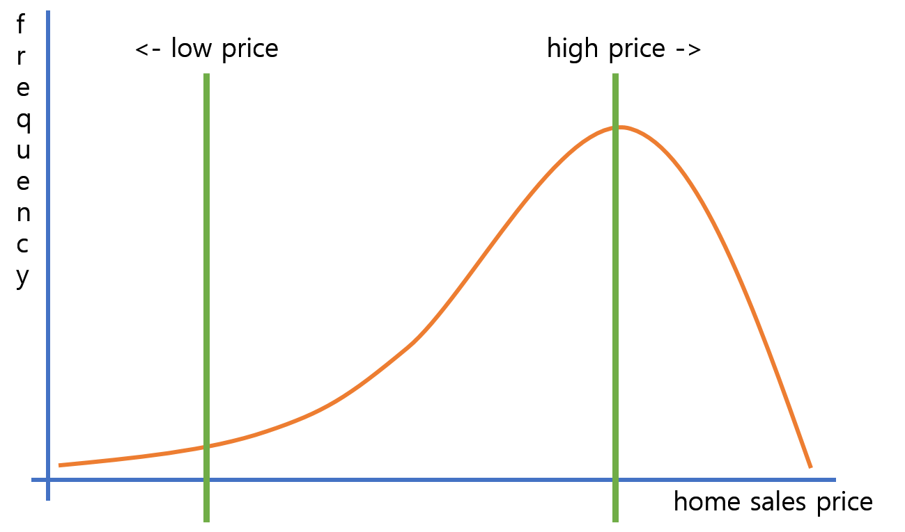

# Skewness and Kurtosis

## Introduction
We have previously identified a normal distribution to be symmetrical in shape. But when you're dealing with real-world data you'll often come across asymmetric distributions as well. In this lesson, you'll learn how to measure asymmetry (or skewness) in a distribution. Additionally, you'll learn about kurtosis. Kurtosis defines whether a distribution is truly "normal" or whether it may have so-called "fatter" or "thinner" tails than you would observe when data are normally distributed.

## Objectives
You will be able to:

* Understand the concept of symmetrical distribution
* Calculate and describe skewness and kurtosis as measures of non-symmetry and diverging from normality

## Symmetric Distributions

A distribution is symmetric if the relative frequency or probability of certain values are equal at equal distances from the point of symmetry. The point of symmetry for normal distributions is the mean (and at the same time median and mode!)

Have a look at following histogram:

This distribution meets all of the conditions of being symmetrical. 

The most common symmetric distribution is the normal distribution, however, there are a number of other distributions that are symmetric. [Here is a good article](https://www.statisticshowto.datasciencecentral.com/symmetric-distribution-2/) that looks into all sorts of symmetrical distributions. We'll focus on normal distributions (by far the most common group) here, and see how these can lose symmetry!

## Skewness

Skewness is the degree of distortion or deviation from the symmetrical bell curve that is a key characteristic of a normal distribution. Skewness can be seen as a measure to calculate the lack of symmetry in the data distribution.

Skewness helps you identify extreme values in one of the tails. Symmetrical distribution has a skewness of 0. There are two types of Skewness: Positive and Negative.

### Positive Skewness

A distribution is **positively skewed** when the tail on the right side of the distribution is longer (or fatter - as it is often called). The mean and median are bigger than the mode.

### Negative Skewness

Distributions are **negatively skewed** when the tail on the left side of the distribution is longer or fatter than the tail on the right side. The mean and median are smaller than the mode.

This behavior is shown in the images below:

Skewness can have implications for data analysis and usage of certain models. The "normality assumption" seen before does not hold when data is skewed. When data is skewed, you'll need to transform the data first. 

### Measuring Skewness

For univariate data $Y_1, Y_2, ..., Y_n$ the formula for skewness is:

$$\dfrac{\dfrac{\displaystyle\sum^n_{i=1}(Y_i-Y)^3}{n}}{s^3}$$

where $Y$ is the mean, $s$ is the standard deviation, and $n$ is the number of data points. This formula for skewness is referred to as the **Fisher-Pearson coefficient of skewness**. There are also other ways to calculate skewness but this one is the one that is used most commonly.

### When is Skewness Too Much?

The rule of thumb seems to be:

* If the skewness is between -0.5 and 0.5, the data are fairly symmetrical.
* If the skewness is between -1 and -0.5 (negatively skewed) or between 0.5 and 1 (positively skewed), the data are moderately skewed.
* If the skewness is smaller than -1 (negatively skewed) or bigger than 1 (positively skewed), the data are highly skewed.

**Example**

Imagine you have house values ranging from 100,000 USD to 1,000,000 USD with the average being 500,000 USD in a given house prices dataset. 

If the peak of the distribution is left of the average value, the house prices are positively skewed. This means that more than half of the houses were sold for less than the average value 500,000 USD, and that there are a limited number of houses that were sold for a much higher value than 500,000 USD. There is a long tail in the higher price ranges.

If the peak of the distributed data is right of the average value, this means there is a negative skew. This means that more than half of the houses were wold for more than the average value of 500,000 USD, yet that there is a long tail in the lower price ranges. 

## Kurtosis

Kurtosis deals with the lengths of tails in the distribution. 

> **Where skewness talks about extreme values in one tail versus the other, kurtosis aims at identifying extreme values in both tails at the same time!**

You can think of Kurtosis as a **measure of outliers** present in the distribution.

The distribution denoted in the image above has relatively more observations around the mean, then a steep decline and longer tails compared to the normal distribution. 

### Measuring Kurtosis

For univariate data $Y_1, Y_2, \dots, Y_n$ the formula for kurtosis is:

$$\dfrac{\dfrac{\displaystyle\sum^n_{i=1}(Y_i-Y)^4}{n}}{s^4}$$

If there is a high kurtosis, then you may want to investigate why there are so many outliers. 
Presence of outliers could be indications of errors on the one hand, but they could also be some interesting observations that may need to be explored further. For banking transactions, for example, an outlier may signify a fraudulent activity. How we deal with outliers mainly depends on the domain. 

Low kurtosis in a data set is an indication that data has light tails or lack of outliers. If we get low kurtosis, then also we need to investigate and trim the dataset of unwanted results.

### How much kurtosis is bad kurtosis?

#### Mesokurtic 

A Mesokurtic distribution has kurtosis statistics similar to those of the normal distribution. According to this definition, the standard normal distribution has a kurtosis of three.

#### Leptokurtic (Kurtosis > 3)

When you have a leptokurtic distribution, you have a distribution with longer and fatter tails. The peak is higher and sharper than Mesokurtic, which means that data are heavy-tailed and there are more outliers. 
Outliers stretch the horizontal axis of the histogram graph, which makes the bulk of the data appear in a narrow (“skinny”) vertical range, explaining the “skinniness” of a leptokurtic distribution.

#### Platykurtic: (Kurtosis < 3) 

Distribution is shorter and tails are thinner than the normal distribution. The peak is lower and broader than Mesokurtic, which means that data are light-tailed, of that there are fewer outliers than would be expected in a normal distribution. 

## Summary 

In this lesson, you learned about skewness and kurtosis. In the next lab, you'll learn how to measure skewness and kurtosis in python. 
